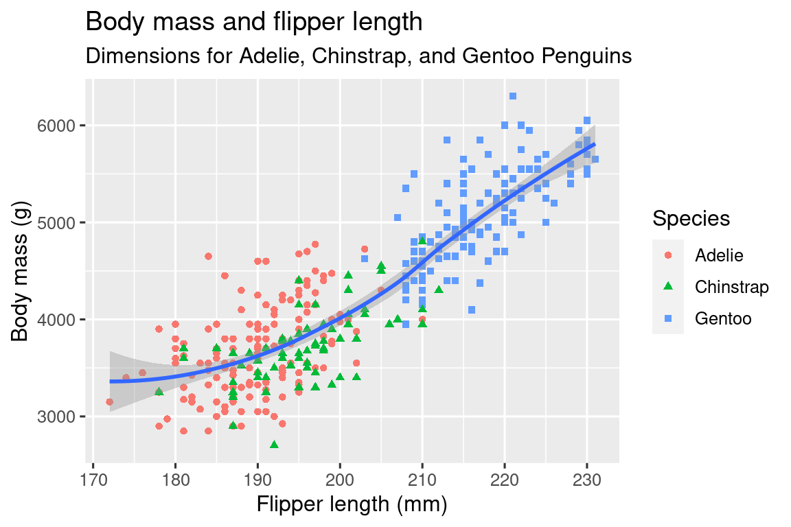

# Aula2 - DataViz

- 2.1 Introdução
    - Na aula de hoje vamos apresentar o pacote ggplot2.
        - Considerado o mais elegante e versátil dentre os vários sistemas de gráficos disponíveis em R.
        - Implementa “gramática dos gráficos”, um sistema coerente para descrever e construir gráficos. Assim vamos poder fazer mais coisas, mais rápido aprendendo um sistema que pode ser utilizado em muitos lugares.
    - Vamos começar fazendo um “scatterplot” (gráfico de dispersão) para introduzir as peças fundamentais do ggplot2:
        - aesthetic mappings e geometric objects.
    - Em seguida vamos construir visualizações de distribuições tanto de variáveis sozinhas quanto de relações entre variáveis.
    - Vamos finalizar salvando os gráficos e apresentando dicas de para solução de possíveis problemas.
    
- 2.1.1 Pré-requisitos
    - ggplot2 faz parte do tidyverse, portanto vamos carrega-lo em memória:
        
        ```r
        library(tidyverse)
        #> ── Attaching packages ──────────────────────────────────── tidyverse 1.3.2 ──
        #> ✔ ggplot2 3.4.0           ✔ purrr   1.0.0.9000 
        #> ✔ tibble  3.1.8           ✔ dplyr   1.0.99.9000
        #> ✔ tidyr   1.2.1.9001      ✔ stringr 1.5.0      
        #> ✔ readr   2.1.3           ✔ forcats 0.5.2      
        #> ── Conflicts ─────────────────────────────────────── tidyverse_conflicts() ──
        #> ✖ dplyr::filter() masks stats::filter()
        #> ✖ dplyr::lag()    masks stats::lag()
        ```
        
        - Esse comando carrega os principais pacotes do tidyverse. Vamos utiliza-los em quase todas as análises de dados. Ele também informa quais funções conflitam, ou seja, que existem funções de mesmo nome em outros pacotes carregados ou no “base R”.
    - Também vamos utilizar o pacote **palmerpenguins** que contém o dataset “penguins” com medidas corporais dos pinguins do arquipélago de Palmer.
        
        ```r
        library(palmerpenguins)
        ```
        
- 2.2 Primeiros passos
    - Vamos criar nosso primeiro gráfico para responder a pergunta:
        - Pinguins com nadadeiras mais longas pesam mais ou menos que pinguins com nadadeiras mais curtas?
    - Você já deve suspeitar da resposta, mas vamos tentar dar uma resposta precisa:
        - Como deve ser ser a relação entre comprimento de nadadeira e massa corporal? Positiva? Negativa? Linear? Não-linear?
        - Por acaso essa relação varia de acordo com a espécie de pinguim?
        - E de acordo com a ilha em que eles vivem?
    - 2.2.1 O data frame ********penguins********
        - Data frame é uma coleção retangular de variáveis e observações em colunas e linhas.
        - ********penguins******** contem 344 observações coletadas e disponibilizadas pela Dra. Kristen Gorman e a Estação Palmer na antartica.
            
            ```r
            penguins
            #> # A tibble: 344 × 8
            #>   species island    bill_length_mm bill_depth_mm flippe…¹ body_…² sex    year
            #>   <fct>   <fct>              <dbl>         <dbl>    <int>   <int> <fct> <int>
            #> 1 Adelie  Torgersen           39.1          18.7      181    3750 male   2007
            #> 2 Adelie  Torgersen           39.5          17.4      186    3800 fema…  2007
            #> 3 Adelie  Torgersen           40.3          18        195    3250 fema…  2007
            #> 4 Adelie  Torgersen           NA            NA         NA      NA <NA>   2007
            #> 5 Adelie  Torgersen           36.7          19.3      193    3450 fema…  2007
            #> 6 Adelie  Torgersen           39.3          20.6      190    3650 male   2007
            #> # … with 338 more rows, and abbreviated variable names ¹flipper_length_mm,
            #> #   ²body_mass_g
            ```
            
        - Esse data frame contém 8 colunas. Podemos usar a função *glimpse()* para apresentá-lo de modo a vermos poucas observações de cada variável. Ou ainda a função View(penguins) para abrir uma janela de visualização interativa.
        
        ```r
        glimpse(penguins)
        #> Rows: 344
        #> Columns: 8
        #> $ species           <fct> Adelie, Adelie, Adelie, Adelie, Adelie, Adelie, A…
        #> $ island            <fct> Torgersen, Torgersen, Torgersen, Torgersen, Torge…
        #> $ bill_length_mm    <dbl> 39.1, 39.5, 40.3, NA, 36.7, 39.3, 38.9, 39.2, 34.…
        #> $ bill_depth_mm     <dbl> 18.7, 17.4, 18.0, NA, 19.3, 20.6, 17.8, 19.6, 18.…
        #> $ flipper_length_mm <int> 181, 186, 195, NA, 193, 190, 181, 195, 193, 190, …
        #> $ body_mass_g       <int> 3750, 3800, 3250, NA, 3450, 3650, 3625, 4675, 347…
        #> $ sex               <fct> male, female, female, NA, female, male, female, m…
        #> $ year              <int> 2007, 2007, 2007, 2007, 2007, 2007, 2007, 2007, 2…
        ```
        
        - Dentre as variáveis em ********penguins******** temos:
            1. *species*: a espécie do pinguim (Adelie, Chinstrap, ou Gentoo)
            2. ****************flipper_leght_mm****************: comprimento da nadadeira do pinguim em milímitros
            3. ************body_mass_g: massa corporal do pinguim em gramas.************ 
        - Para mais informações sobre penguins podemos abrir a página de ajuda utilizando o comando:
            
            ```r
            /penguins
            ```
            
    - 2.2.2 Objetivo Final
        - Nosso objetivo final é recriar a seguinte visualização apresentando a relação entre o comprimento das nadadeiras e a massa corporal desses pinguins, considerando a espécie de cada um:
            
            
            
    - 2.2.3 Criando um gráfico com ggplot
        - Vamos recriar o gráfico camada por camada
        - Iniciamos com a função *ggplot()* que define um objeto de plotagem no qual podemos adicionar camadas.
            - O primeiro argumento dessa função é o dataset que será usado no gráfico, então *ggplot(data = penguins)* cria um gráfico vazio. Não é muito animador, mas é nessa tela que colocaremos as camadas do nosso gráfico.
                
                ```r
                ggplot(data = penguins)
                ```
                
                
                
            
        - Em seguida, vamos informar a *ggplot()* quais as variáveis do data frame que queremos mapear para propriedades visuais (aesthetics) do plot.
            - O argumento ***************mapping*************** da função *******ggplot()******* define como as variáveis do data set vão ser mapeadas para propriedades visuais do gráfico.
            - O *******mapping******* sempre recebe o resolta do da função **aes()**, que por sua vez tem os argumento **x** e **y para especificar quais variáveis mapear com os eixos x e y.**
            - Assim, vamos mapear o comprimento da nadadeira para o eixo x da *******aesthetic******* e a massa corporal para o eixo y da aesthetic.
            - O ggplot vai automaticamente procurar essas variáveis no argumento ******data.******
            - Vamos plotar o resultado de adicionar esses mapeamentos:
                
                ```r
                ggplot(
                  data = penguins,
                  mapping = aes(x = flipper_length_mm)
                )
                ggplot(
                  data = penguins,
                  mapping = aes(x = flipper_length_mm, y = body_mass_g)
                )
                ```
                
                
                
                
                
            - Vemos que o gráfico está preparado para apresentar as variáveis nos seus eixos adequados. Mas ainda está em branco. Isto ocorre porque ainda não articulamos no código **como representar** as **observações** do nosso **data frame** no **nosso gráfico.**
        - Para articular essa representação precisar definir uma **********geom**********
            - O objeto geométrico que o gráfico usa para representar dados
            - Esses objetos estão disponíveis no ggplot2 por meio de funções que iniciam com *geom_.*
            - Gráficos geralmente são definidos pelo tipo de geometria que utilizam. Por exemplo, gráficos de barras usam *geom_bar()*, gráficos de linha usam *geom_line()*, boxplots usam *geom_boxplot()* e assim sucessivamente.
            - Entretanto, o scatterplot quebra essa sequência, ele utiliza *geom_point().*
            - A função *geom_point()* adiciona uma camada de pontos ao gráfico, criando uma dispersão de pontos.
                
                ```r
                ggplot(
                  data = penguins,
                  mapping = aes(x = flipper_length_mm, y = body_mass_g)
                ) +
                  geom_point()
                #> Warning: Removed 2 rows containing missing values (`geom_point()`).
                ```
                
                
                
        - Agora sim temos um gráfico de dispersão de pontos. Ainda não responde nosso objetivo principal, mas já podemos ter uma noção da relação entre nadadeira e massa corporal dos pinguins.
            - Vemos que em geral é uma relação positiva, um tanto linear, e moderadamente forte.
            - Pinguins com nadadeiras maiores, em geral são mais pesados.
        - Também podemos observar uma mensagem de aviso: “Removed 2 rows containing missing values (`geom_point(`).”
            - Essa mensagem está nos avisando que duas observações estavam com dados faltantes nas variáveis que tentamos exibir, portanto não tinham como esses pontos serem exibidos.
            - Não vamos nos preocupar muito com isso por enquanto, mas dados faltantes é uma das situações mais comuns em problemas do mundo real.
    - 2.2.4 Adicionando estética e camadas
        - Scatterplots são úteis para apresentar a relação entre duas variáveis, mas é sempre bom manter o ceticismo quanto a relação aparente.
        - Por exemplo perguntar se outras variáveis podem explicar ou modificar a natureza da relação aparente.
        - Vamos adicionar a espécie dos pinguins para ver se ela nos dá novos insights sobre a relação do comprimento da nadadeira e a massa corporal. Vamos representar a espécie como **cor** dos pontos no gráfico.
        - Onde vocês acham que devemos colocar a espécie nesse código?
            
            ```r
            ggplot(  
              data = penguins,
              mapping = aes(x = flipper_length_mm, y = body_mass_g)
            ) +
              geom_point()
            ```
            
        - Assim: no mapeamento estético, dentro da função *aes()*
            
            ```r
            ggplot(  
            	data = penguins,
              mapping = aes(x = flipper_length_mm, y = body_mass_g, color = species)
            ) + 
            	geom_point()
            ```
            
            
            
            - Quando uma variável é mapeada a uma estética ggplot2 automaticamente atribui um valor estético único (nesse caso uma cor) para cada valor da variável (nesse cada cada uma das três espécies). Esse processo é denominado ****************scaling****************. ggplot2 também adiciona a legenda explicando qual valor estético corresponde a qual valor da variável.
        - Vamos agora adicionar uma nova camada: uma curva suave representando a relação entre a massa corporal e o comprimento de nadadeira dos pinguins.
            - Onde vocês acham que precisamos mexer no código pra isso?
                
                ```r
                ggplot(  
                	data = penguins,
                	mapping = aes(x = flipper_length_mm, y = body_mass_g, color = species)
                  ) +
                  geom_point() +
                	geom_smooth()
                ```
                
                
                
            - Adicionamos com sucesso as curvas. Mas o gráfico não está igual nosso objetivo, que tem apenas uma curva, ao invés de uma curva para cada espécie
            - Quando os mapeamentos estéticos são definidos na *ggplot()* eles são são herdados pelas camadas geométricas subsequentes. Entretanto, cada função *geom_* também pode receber um argumento de mapping que permite mapeamento estético local naquela geometria.
            - Como queremos os pontos coloridos mas não queremos a curva separada por cor, devemos especificar *color = species* apenas para *gem_point().*
                
                ```r
                ggplot(
                 data = penguins,
                 mapping = aes(x = flipper_length_mm, y = body_mass_g)
                ) +
                geom_point(mapping = aes(color = species)) +
                geom_smooth()
                ```
                
                
                
            - Vóila! Estamos quase lá! Falta apenas usar formas diferentes para representar as espécies diferentes, atém das cores.
            - Em geral não é uma boa ideia utilizar apenas cores para representar informação em um gráfico porque as pessoas percebem cores de forma diferente, inclusive por daltonismo e outras diferenças de percepção cromática.
        - Assim, além das cores vamos mapear *******species******* a estética  ******shape******.
            
            ```r
            ggplot(
             data = penguins,
             mapping = aes(x = flipper_length_mm, y = body_mass_g)
            ) +
            geom_point(mapping = aes(color = species, shape = species)) +
            geom_smooth()
            ```
            
            
            
            - Vemos que a legenda também atualizou para refletir as formas diferentes dos pontos.
        - Finalmente, resta apenas ajustar as legendas do nosso gráfico.
            - Vamos usar a função ******labs()****** em uma nova camada, seus nomes são auto explanatórios:
            
            ```r
            ggplot(  
            	data = penguins,
              mapping =aes(x = flipper_length_mm, y = body_mass_g)
            ) +
            	geom_point(aes(color = species, shape = species)
            	) +
            	geom_smooth() +
            	labs(    title = "Body mass and flipper length",
                subtitle = "Dimensions for Adelie, Chinstrap, and Gentoo Penguins",
                x = "Flipper length (mm)",
                y = "Body mass (g)",
                color = "Species",
                shape = "Species"  
            	)
            
            ```
            
- 2.3 Chamadas ggplot2
    - Agora que já sabemos usar a função *ggplot()* vamos usar os argumentos posicionais ao invés de usar as palavras chave “data” e “mapping”.
        - Elas foram úteis pro aprendizado, subtraí-las nos permite escrever menos e ver mais fácil a diferença entre códigos. Vamos passar a escrever assim:
            
            ```r
            ggplot(penguins,aes(x = flipper_length_mm, y = body_mass_g)) +
            geom_point()
            ```
            
        - Futuramente vamos usar a notação mais utilizada usando pipes:
            
            ```r
            penguins |>
            ggplot(aes(x = flipper_length_mm, y = body_mass_g)) +
            geom_point()
            ```
            
- 2.2.5 Exercícios
    1. Quantas linhas tem o ******penguins******? E quantas colunas?
    2. O que a variável *****bill_depth_mm***** no *********penguins********* descreve? (dica: use a função *********?penguins*********)
    3. Faça um gráfico de dispersão (scatterplot) do bill_depth_mm vs bill_length_mm. Descreva a relação entre essas duas variáveis. 
    4. O que acontece se você fizer um gráfico de dispersão (scatterplot) de *species* vs *************bill_depth_mm*************? ~~Por que esse gráfico é inútil?~~ [argumento que é útil sim!]
    5. Por que o código dá erro e como poderíamos resolver? 
        
        ```r
        ggplot(
        	data = penguins
        ) +
        geom_point()
        ```
        
    6. O que o argumento na.rm faz no ************geom_point()************? Qual é o valor padrão desse argumento? Crie um gráfico de dispersão (scatterplot) onde você usa com sucesso este argumento definido como TRUE.
    7. Adicione a seguinte legenda ao gráfico que você fez no exercício anterior: “Os dados vêm do pacote palmerpenguins”. Dica: dê uma olhada na documentação de *labs()*.
    8. Recrie a seguinte visualização. Para qual estética o bill_depth_mm deve ser mapeado? E deve ser mapeado no nível global ou no nível geom?
        
        
        
    9. Execute esse código em sua cabeça e preveja como será a saída. Em seguida, execute o código em R e verifique suas previsões. Foi o que você esperava? 
        
        ```r
        ggplot(  
        	data = penguins,
          mapping = aes(x = flipper_length_mm, y = body_mass_g, color = island)
        ) +
        	geom_point() +
        	geom_smooth(se = FALSE)
        ```
        
    10. Esses códigos geram gráficos iguais ou diferentes? Por que?
        
        ```r
        ggplot(  
        	data = penguins,
        	  mapping = aes(x = flipper_length_mm, y = body_mass_g)
        ) +
        	geom_point() +
        	geom_smooth()
        
        ggplot(
        ) +
        geom_point(    
        	data = penguins,
          mapping = aes(x = flipper_length_mm, y = body_mass_g)  
        ) +
        geom_smooth(    
        		data = penguins,
            mapping = aes(x = flipper_length_mm, y = body_mass_g)  )
        ```
        

- 2.4 Visualizando distribuições
    - A maneira de visualizar uma variável depende do seu tipo: numérica ou categórica.
    - 2.4.1 Variável categórica
        - Uma variável é **********************categórica********************** quando ela pode assumir apenas um pequeno conjunto de valores.
        - Podemos usar gráficos de barra para examinar sua distribuição. A altura das barras apresenta quantas observações ocorreram para cada valor de *x*.
            
            ```r
            ggplot(penguins,aes(x = species)) +
            	geom_bar()
            ```
            
            
            
        - Para variáveis categóricas com níveis não ordenadas como as espécies de pinguim, é frequentemente preferível reordená-las baseado em sua frequências.
            - Para fazer isso em R nós transformamos a variável em um fator e reordenamos os níveis do fator. Basta utilizar-mos a função *fct_infreq()*.
                
                ```r
                ggplot(penguins, aes(x = fct_infreq(species))) +
                	geom_bar()
                ```
                
                
                
        
    - 2.4.2 Variável numérica
        - Uma variável numérica pode assumir qualquer valor de um conjunto infinito de valores ordenados. Números e data-time são exemplos de variáveis contínuas.
        - Para visualizarmos variáveis contínuas podemos usar histograma ou um plot de densidade.
            
            ```r
            ggplot(penguins,aes(x = body_mass_g)) +geom_histogram(binwidth = 200)
            ```
            
            
            
            - Um histograma divide o eixo x em caixas igualmente espaçadas de modo que a sua altura represente o número de observações dentro dela. No gráfico acima a barra mais alta tem 39 observações de pinguins com massa corporal em gramas (*body_mass_g)* entre 3.500 e 3.700 gramas, justamente os limites da caixa.
            
            ```r
            penguins |>
              count(cut_width(body_mass_g, 200))
            #> # A tibble: 19 × 2
            #>   `cut_width(body_mass_g, 200)`     n
            #>   <fct>                         <int>
            #> 1 [2.7e+03,2.9e+03]                 7
            #> 2 (2.9e+03,3.1e+03]                10
            #> 3 (3.1e+03,3.3e+03]                23
            #> 4 (3.3e+03,3.5e+03]                38
            #> 5 (3.5e+03,3.7e+03]                39
            #> 6 (3.7e+03,3.9e+03]                37
            #> # … with 13 more rows
            ```
            
            - Você pode definir a largura dos intervalos no histograma com o argumento *******binwidth******* que é medido de acordo com unidades da variável x. Você deve sempre explorar números diferentes pra esse argumento, porque diferentes larguras de caixa podem revelar padrões diferentes.
            - Podemos ver que um intervalo de 20 é muito estreito, resultando em muitas barras e tornando difícil determinar o formato da distribuição.
            - O intervalo de 2.000 já é muito grande, resultando em dados encaixados apenas em três caixas o que também não esclarece a distribuição da variável.
            
            ```r
            ggplot(penguins, aes(x = body_mass_g)) +
              geom_histogram(binwidth = 20)
            ggplot(penguins, aes(x = body_mass_g)) +
              geom_histogram(binwidth = 200)
            ggplot(penguins, aes(x = body_mass_g)) +
              geom_histogram(binwidth = 2000)
            ```
            
            
            
            
            
            
            
- 2.4.3 Exercícios
    1. Faça um gráfico de barras das espécies de pinguins onde você atribui a espécie ao eixo y da estética. Qual é a diferença desse gráfico? 
    2. Qual é a diferença entre os dois gráficos a seguir? Qual estética entre *color* e ****fill**** é mais útil para mudar a cor das barras? 
        
        ```r
        ggplot(penguins, aes(x = species)) +
          geom_bar(color = "red")
        
        ggplot(penguins, aes(x = species)) +
          geom_bar(fill = "red")
        ```
        
    3. O que o argumento ****bins**** faz na função ****************geom_histogram()****************?
    4. Faça um histograma da variável *****carat***** do dataset ********diamonds********. Experimento com diferentes larguras de barras (binwidth). Qual largura revela os padrões mais interessantes? 
    
- 2.5 Visualizando relações
    - Para visualizar uma relação nós precisamos ter pelo menos duas variáveis mapeadas a estética de um gráfico. Vamos aprender sobre gráficos comumente utilizados para visualizar relações entre duas ou mais variáveis e as geometrias usadas para criá-los.
    - 2.5.1 Uma variável numérica e uma categórica
        - Para visualizar a relação entre uma variável numérica e uma categórica podemos boxplots. O **boxplot** é um tipo de representação visual para a distribuição de valores muito popular entre estatísticos.
        - A figura a seguir mostra que todo boxplot consiste em :
            - Uma caixa que se estende do 25th ao 75th percentis, distância conhecida como Intervalo Inter Quartis (IQR). No meio da caixa está a linha mediana, ou 50th percentil da distruibuição.
            - Essas três linhas dão uma boa noção da dispersão e simetria da distribuição.
            - Pontos são utilizados para os dados que se encontram mais do que 1.5 vezes a distância dos limites da caixa, chamados outliers.
            - Uma linha, ou se estende da caixa até o ponto não-outlier mais distante da distribuição.
                
                
                
        - Vamos dar uma olhada na distribuição da massa corporal das espécies usando a **************geom_boxplot()**************:
            
            ```r
            ggplot(penguins, aes(x = species, y = body_mass_g)) +
              geom_boxplot()
            ```
            
            
            
        - Alternativamente podemos usar polígonos de frequência com *************geom_freqpoly()*************.
            - Essa geometria faz os mesmos cálculos que a **********geom_histogram()**********, mas ao invés de apresentar as contagens em barras ela utiliza linhas. É muito mais fácil de compreender linhas sobrepostas que barras sobrepostas.
                
                ```r
                ggplot(penguins, aes(x = body_mass_g, color = species)) +
                  geom_freqpoly(binwidth = 200, linewidth = 0.75)
                ```
                
                
                
                - C*u*stomizamos a espessura das linhas com o *********linewidth*********
        - Também podemos sobrepor gráficos de densidade com *******species******* mapeado tanto para *****color***** quanto para *****fill***** e usando o *****alpha***** na estética para adicionar transparência ao preenchimento das curvas.
            - Essa estética varia do 0 (completamente transparente) ao 1 (completamente opaca).
                
                ```r
                ggplot(penguins, aes(x = body_mass_g, color = species, fill = species)) +
                  geom_density(alpha = 0.5)
                ```
                
                
                
        - Importante ressaltar a terminologia que usamos:
            - Mapeamos variáveis à estéticas se queremos que os atributos visuais representados por essa estética variem com os valores da variável.
            - Do contrário, atribuímos o valor a uma estética.
    - 2.5.2 Duas variáveis categóricas
        - Podemos segmentar um gráfico de barras para visualizar a distribuição de duas variáveis.
            - Nesse caso, mapeamos a variável pela qual queremos dividir os dados na estética *x*. Além disso, mapeamos a variável que queremos dividir os grupos na estética **fill.**
            - Podemos ainda utilizar esse gráfico para representar as frequências relativas de cada variável de nosso interesse.
        - A seguir apresentamos dois gráficos de barra segmentados. Ambos apresentando a relação entre ******island****** e species, mais especificamente visualizando a distribuição de espécies em cada ilha.
            - O primeiro gráfico apresenta a frequência, ou contagem de cada espécie em cada ilha.
            - Já o segundo apresenta a frequência relativa, ou proporção de cada espécie em cada ilha. Nesse caso, o eixo y está incorretamente nomeado de “count”.
            - Neles podemos ver que todos os Gentoos vivem na ilha Biscoe, sendo eles ~75% de sua população. Todos os Chinstrap vivem na ilha Dream sendo ~50% de sua população. Finalmente os Adelie vivem nas três ilhas, e são a única espécie da ilha Togersen.
                
                ```r
                ggplot(penguins, aes(x = island, fill = species)) +
                  geom_bar()
                ggplot(penguins, aes(x = island, fill = species)) +
                  geom_bar(position = "fill")
                ```
                
                
                
                
                
    - 2.5.3 Duas variáveis numéricas
        - Já aprendemos sobre os scatterplots (************geom_point()************) e as curvas suaves (*************geom_smooth()*************) para visualizar a relação entre duas variáveis numéricas. O scatterplot é provavelmente o gráfico mais comum para esse representação.
            
            
            
        
    - 2.5.4 Três ou mais variáveis
        - Uma forma de adicionar uma variável adicional é a mapeando a uma estética. Por exemplo o gráfico a seguir utiliza cores para representar as espécies e formas para representar as ilhas.
            
            ```r
            ggplot(penguins, aes(x = flipper_length_mm, y = body_mass_g)) +
              geom_point(aes(color = species, shape = island))
            ```
            
            
            
            - Entretanto, adicionar muitos mapeamentos estéticos num gráfico o torna confuso e difícil de compreender.
        - Outra abordagem, especialmente útil para variáveis categóricas é de separar o gráfico em ************facets************, subgráficos onde cada um apresenta um subconjunto dos dados.
            - Para facetar seu gráfico por uma única variável, use *facet_wrap()*.
            - O primeiro argumento de *facet_wrap()* é uma formula que você cria com ~ seguido por um nome de variável. A variável que você passa para facet_wrap() deve ser categórica.
            
            ```r
            ggplot(penguins, aes(x = flipper_length_mm, y = body_mass_g)) +
              geom_point(aes(color = species, shape = species)) +
              facet_wrap(~island)
            ```
            
            
            
        
- 2.5.5 Exercícios
    1. Qual das variáveis no dataset ***mpg*** são categóricas? Quais são continuas? (dica: digite *?mpg* no console para ler a documentação). 
    2. Faça um scatterplot de **hwy** vs *****displ***** usando o datafeame ***mpg***. Em seguida, mapeie uma terceira variável numérica à *****color*****, depois a mapeie para *****size*****, depois a mapeie para ******color****** e ****size**** simultaneamente, finalmente mapeie essa terceira variável para *****shape*****. Qual é a diferença no comportamento dessas estéticas? 
    3. ~~No scatterplor de hwy vs displ, o que acontece se você mapear uma terceira variável ao linewidth?~~ 
    4. O que acontece se você mapear a mesma variável para múltiplas estéticas? 
    5. Faça um scatterplot de bill_depth_mm vs. bill_length_mm e cor dos pontos para as espécies. O que adicionar cor revela sobre a relação entre as duas variáveis? 
    6. Por que o gráfico seguinte apresenta duas legendas separadas? Como você faria para combinar as suas legendas em uma? 
        
        ```r
        ggplot(
          data = penguins,
          mapping = aes(
            x = bill_length_mm, y = bill_depth_mm, 
            color = species, shape = species
          )
        ) +
          geom_point() +
          labs(color = "Species")
        ```
        
        
        
- 2.6 Salvando seus gráficos
    - Para salvar os gráficos usamos a função ********ggsave()********. Ela salva o gráfico mais recente na pasta do seu projeto (working directory).
    - Você pode especificar altura e largura, do contrário ela vai salvar nas dimensões atuais.
    - Para mais informações sobre a função é só *?ggsave()*
- 2.6.1 Exercícios
    1. Qual dos gráficos será salvo pela função ggsave? 
        
        ```r
        ggplot(mpg, aes(x = class)) +
          geom_bar()
        ggplot(mpg, aes(x = cty, y = hwy)) +
          geom_point()
        ggsave("mpg-plot.png")
        ```
        
    2. O que você precisa mudar no código acima para salvar o gráfico como PDF ao invés de PNG?
- 2.8 Sumário
    - Nesse capítulo aprendemos o básico de visualização de dados com ggplot2.
        - Iniciamos com a ideia básica que fundamenta essa ferramenta: visualização é um mapeamento de variáveis nos dados com propriedades estéticas como posição cor, tamanho e formato. Que por sua vez são apresentadas de acordo com determinada geometria.
        - Aprendemos com complexidade incremental e melhorar nossa apresentação camada por camada.
        - Aprendemos sobre tipos de gráficos comumente utilizados para representar distribuições e relações entre variáveis além de utilizar mapeamento estético adicional e separar o gráfico em pequenos múltiplos chamados facetas.
        - Finalmente vimos a função necessária para salvar nossos gráficos fora do R e usamos onde quisermos.