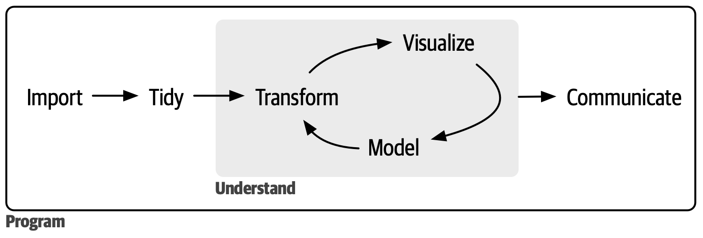
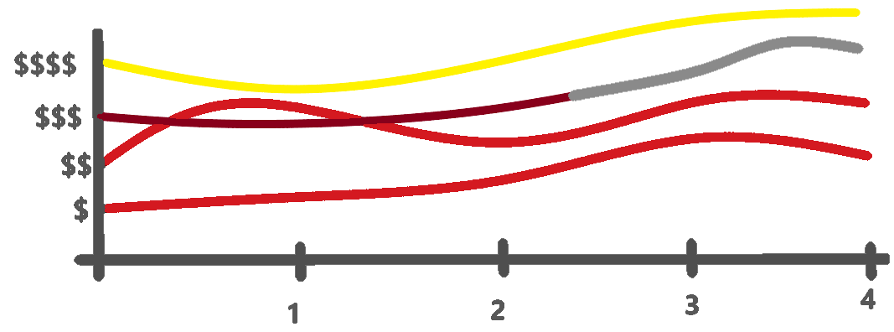
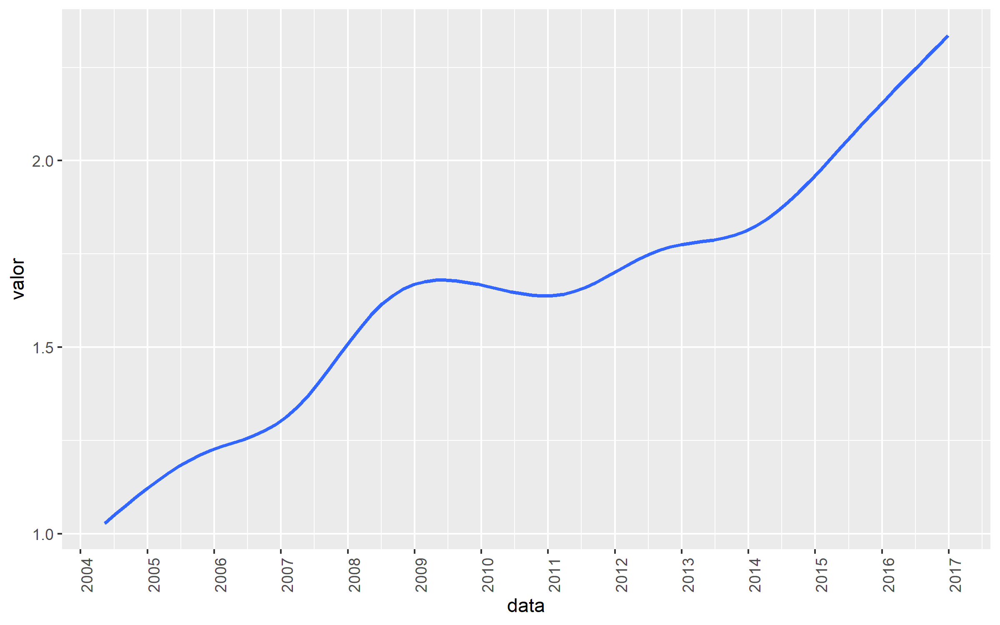
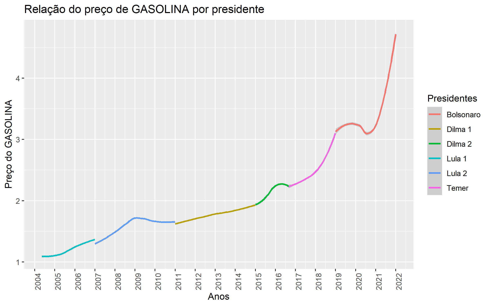
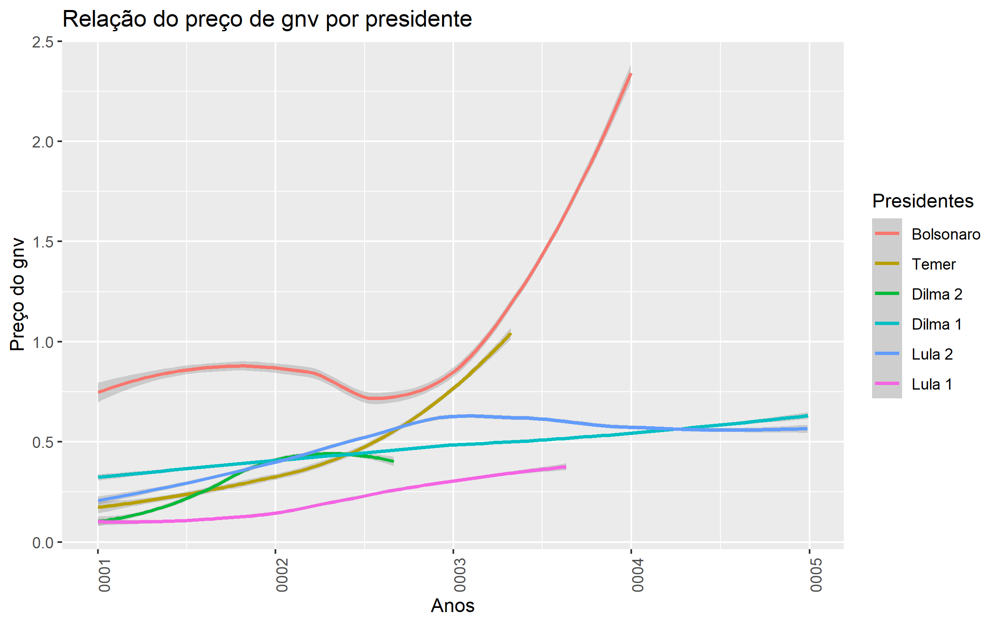
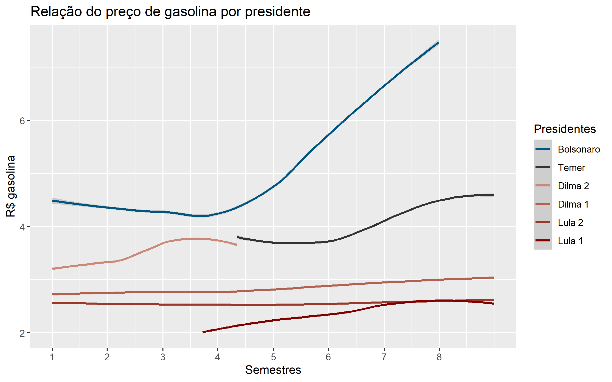

# Trabalho final

Este trabalho se trata de um relatório de análise de dados para a disciplina vulgarmente chamada de "Introdução a Data Science". Ao longo do relatório serão expostas as motivações para a análise específica, a pergunta a ser respondida, uma amostra dos dados, a estrutura do gráfico esperado, os códigos realizados em [R][RLang] e o gráfico final encontrado.

Ao longo de uma análise de dados, um determinado conjunto de ações é realizado. Este conjunto pode ser ilustrado pela imagem abaixo:



Neste trabalho, estes processos serão distribuídos da seguinte forma:

- As etapas *Import*, *Tidy* e *Understand: Transform* serão realizadas no tópico **Preparação dos dados**
- A etapa *Understand: Visualize* será apresentada no tópico **Análise dos dados**
- A etapa *Communicate* será realizada no tópico **Conclusão**
- E será deixado de fora deste trabalho a etapa *Understand: Model*, considerando que não houve enfoque nesse item durante a disciplina.

[RLang]: https://www.r-project.org/

## Definição do problema
<!-- Explique breve e claramente a pergunta ou problema que vai investigar. -->

A pergunta que viso responder é:

> De que forma o valor do combustível tende a variar ao longo do governo das presidências?

Suponho que o resultado final se aproxime de algo como este gráfico esboçado no [Paint 3D][LinkPaint]:



Ou seja, imagino que em cada segmento de 4 anos, o combustível tenderá a estar mais caro que no período anterior, entretanto, cada um desses segmentos deverá apresentar um grau diferente de variabilidade ao longo do período. É essa diferença que se visa analisar por fim.

[LinkPaint]: https://apps.microsoft.com/store/detail/paint-3d/9NBLGGH5FV99

## Apresentação dos dados
<!-- Apresente os dados que vai utilizar e como pretende utilizá-los para abordar sua pergunta ou problema. -->

Eu escolhi analisar a [Série Histórica de Preços de Combustíveis][LinkDados] disponibililizado pela [Agência Nacional do Petróleo, Gás Natural e Biocombustíveis - ANP][LinkANP].

Eu escolhi esse dataset por apresentar várias variáveis que me permitem fazer diversas análises, há também milhões de observações realizadas distribuídas ao longo de 19 anos. Além disso, os dados tratam de algo que tem sido relevante para o momento atual brasileiro (2022~2023): o elevado preço dos combustíveis, principalmente da gasolina.

[LinkANP]: https://www.gov.br/anp/pt-br
[LinkDados]: https://dados.gov.br/dados/conjuntos-dados/serie-historica-de-precos-de-combustiveis-por-revenda

Pretendo alcançar esta resposta ao realizar os seguintes passos:

1. Importar os dados
   1. buscando facilitar o tratamento posterior, aumentando a eficiência e reduzindo o consumo de armazenamento
2. Limpar os dados
   1. Modificar nomes das colunas
   2. Filtrar dados desnecessários
   3. Remover linhas com dados faltantes
3. Manipular os dados
   1. Calcular o preço médio do combustível ao redor do Brasil para cada um dos dias
   2. Ordenar por data
   3. Criar uma nova coluna definindo qual presidente estava no poder na data determinada
   4. Corrigir a data para estar relativa a que semestre do mandato em que se está
   5. Corrigir os dados faltantes do Lula
   6. Ajustar a entrada do Temer
4. Apresentar os dados de forma gráfica

### Dataset escolhido

O dataset escolhido conta com um total de 37 arquivos. Todos eles seguindo o seguinte padrão de nome "ca-AAAA-SS.csv"

- "ca": se refere às iniciais de "Combustível Automotivo"
- AAAA: é um valor inteiro referente ao ano em questão, podendo ser um valor entre 2004 e 2022
- "SS": é o valor referente ao semestre. É "01" caso se refira ao primeiro semestre ou "02" caso se refira ao segundo.

Cada tabela importada varia em torno de 300 mil e 900 mil observações. Todas elas, após importadas, apresentam um total de 21.836.285 observações. Os dados contém um total de 16 colunas e seus metadados são encontrados em formato pdf [neste site][LinkMetadados]. Abaixo são exibidas algumas informações presentes no pdf (algumas modificadas por mim para trazer maior clareza).

Obs.: nos metadados o termo "revenda" equivale a "Posto de combustivel" ou "local onde há o comércio de combustível".

| Nome da coluna      | Tipo do dado             | Descrição                                                                                      | Exemplos de valores                                                                                  |
| ------------------- | ------------------------ | ---------------------------------------------------------------------------------------------- | ---------------------------------------------------------------------------------------------------- |
| Regiao - Sigla      | alfanumérico             | Código da região brasileira em que se está localizado a revenda                                | "CO", "N", "NE", "S", "SE"                                                                           |
| Estado - Sigla      | alfanumérico             | Código do estado brasileiro em que se está localizado a revenda                                | "ES", "GO", "TO"                                                                                     |
| Municipio           | alfanumérico             | Nome do município da revenda                                                                   | "JAPARATUBA", "CARAGUATATUBA", "INDAIATUBA", "UBATUBA"                                               |
| [Revenda][ExpRev]   | alfanumérico             | Nome da revenda                                                                                | "ZURANO AUTO POSTO LTDA", "MIMIM COMERCIO DE COMBUSTIVEIS EIRELI", "MINIANO COMBUSTIVEIS LTDA"       |
| CNPJ da Revenda     | [alfanumérico*][ExpAlfa] | Número do Cadastro Nacional de Pessoa Jurídica                                                 | "00.000.042/0001-22",  "00.000.042/0002-03"                                                          |
| Nome da Rua         | alfanumérico             | Nome do logradouro                                                                             | " IRINEU PINTO", "GLEBA", "LADEIRA DO CAMURUJIPE3"                                                   |
| Numero Rua          | alfanumérico             | Número do logradouro                                                                           | "0,041666667", 90130, 229000                                                                         |
| Complemento         | alfanumérico             | Complemento do logradouro                                                                      | "-50", "KM 364+40 METROS", "FUNDOS PARA JACU PESSEGO Nº 4700"                                        |
| Bairro              | alfanumérico             | Nome do bairro                                                                                 | ÁGUA: BRANCA, DE MENINOS, DOCE, FRESCA, FRIA, LIMPA, PARADA, PRETA, QUENTE, RASA, RAZA, SANTA, VERDE |
| Cep                 | alfanumérico             | Número do Código do Endereço Postal (CEP) do logradouro                                        | 00000-000, 01000-000, 99935-800                                                                      |
| Produto             | alfanumérico             | Nome do combustível                                                                            | "GASOLINA", "ETANOL", "DIESEL", "GNV", "DIESEL S50", "DIESEL S10", "GASOLINA ADITIVADA"              |
| Data da Coleta      | data                     | Data da coleta do(s) preço(s)                                                                  | "10/05/2004", "30/06/2022"                                                                           |
| Valor de Venda      | numerico                 | Preço de venda ao consumidor final praticado pelo revendedor                                   | "0,799", "1,899", "2"                                                                                |
| Valor de Compra     | numerico                 | Preço de distribuição (preço de venda da distribuidora para o posto revendedor de combustível) | "0,4214", "2,437", "2,08899"                                                                         |
| Unidade de Medida   | alfanumérico             | Unidade de Medida                                                                              | "R$ / litro", "R$ / m³"                                                                              |
| Bandeira            | alfanumérico             | Nome da [Bandeira][ExpBnd] da revenda                                                          | "BRANCA", "COSAN LUBRIFICANTES", "MAGNUM", "WALENDOWSKY", "TORRAO", "TRIANGULO"                      |

[LinkMetadados]: https://www.gov.br/anp/pt-br/centrais-de-conteudo/dados-abertos/arquivos/shpc/metadados-serie-historica-precos-combustiveis.pdf "Metadados"
[ExpAlfa]: "Nos metadados, o CNPJ é tido como numerico, mas ele me parece mais um alfanumérico por conter vírgula, ponto e hifen"
[ExpRev]: "'Posto de combustível' ou 'local onde há o comércio de combustível'"
[ExpBnd]: "O Posto bandeirado é aquele que opta por exibir a marca comercial de um distribuidor, o posto deverá vender somente combustíveis fornecidos pelo distribuidor detentor da marca comercial exibida aos consumidores. Já o Posto bandeira branca é o que opta por não exibir marca comercial de nenhuma distribuidora."

### Colunas desejadas

Apesar da riqueza de informações obtidas com este dataset, apenas serão visadas as seguintes colunas:

- Produto: nos permitirá segmentar a variação de preços por tipo de combustível, ou agrupar todos eles, ou selecionar apenas algum
- Data da Coleta: essencial para traçar o gráfico considerando as fatias de tempo desejadas
- Valor de Venda: garante que possamos analisar a flutuação dos preços

## Preparação dos dados
<!-- Descreva a obtenção, limpeza e transformações que foram necessárias para sua análise. Apresente o código utilizado nesse processo. -->

Tendo sido escolhidos e apresentados os dados e seus "problemas", comecemos a preparação.

### Preparando o knitr

Para gerar este arquivo, estou usando o knitr para processar o R Markdown. Para que ele funcione de forma estável, é recomendável definir algumas configurações.

```{r setup, include=FALSE, cache = FALSE}
library(knitr)
cwd <- getwd()
opts_knit$set(root.dir = cwd)
opts_chunk$set(root.dir = cwd)
knitr::opts_knit$set(root.dir = cwd)
isKnitting <- isTRUE(getOption("knitr.in.progress"))
isKnitting
```

### Bibliotecas

Antes de realizarmos quaisquer operações nos dados, primeiro precisamos instalar e importar as bibliotecas que serão utilizada para a manipulação dos dados. O [tidyverse][LinkTDVS] é uma coleção de diversos pacotes em R que facilitam a manipulação dos dados. Já o lubridate é uma biblioteca (supostamente pertencente ao tidyverse, mas que apresentou problemas durante a execução) que traz funções apropriadas para a manipulação de datas.

[LinkTDVS]: https://www.tidyverse.org/
[LinkLBDT]: https://lubridate.tidyverse.org/

- **Instalando as bibliotecas**

Obs.: esta primeira linha é uma configuração que define qual repositório será utilizado automaticamente pela instalação de pacotes.

```{r Instalando_as_bibliotecas}
options(repos = c(CRAN = "https://cran.r-project.org/"))
if (!require(lubridate)) {
  install.packages("lubridate")
}

if (!require(tidyverse)) {
  install.packages("tidyverse")
}
```
<!-- install.packages("png") -->

- **Carregando as bibliotecas**

```{r Carregando_as_bibliotecas}
library(tidyverse)
library(lubridate)
```

<!-- library(png) -->

### Import

Nessa etapa, iremos realizar a "aquisição" dos dados. Importando os dados de sua fonte de origem e os estruturando de uma forma específica no código para que possamos trabalhar com eles. Mas antes de atingirmos o molho, precisamos primeiro preparar os tomates.


#### Preparações
<!-- Adicionar um grafo em mermaid para ilustrar o processo? Não -->

Quanto à importação, precisamos primeiro definir de que forma importaremos os dados: serão baixados diretamente da fonte ou serão utilizados dados baixados manualmente em formato CSV?

Para reduzir o tempo de importação durante o desenvolvimento deste projeto, optei por importar os arquivos baixados manualmente, mas deixarei a disposição o método para importar diretamente da fonte.

##### Obter códigos dos arquivos

Independente de qual seja o método de entrada, precisaremos dos nomes de todos os códigos a serem importados organizados em um vetor, e o bloco abaixo realiza esta tarefa.

Obs.: O código abaixo está limitado aos dados disponibilizados até o dia 09/02/2023, onde estavam disponíveis os dados que iam desde 2004-01 a 2022-01.

```{r Obtendo_código_dos_arquivos}
years <- c(2004:2021)
semesters <- c("-01", "-02")
expanded_grid <- expand.grid(years, semesters)
all_file_codes <- sort(paste0(expanded_grid$Var1, expanded_grid$Var2))
all_file_codes <- append(all_file_codes, "2022-01")
sufix <- "ca-"
extension <- ".csv"
all_complete_file_codes <- paste0(sufix, all_file_codes, extension)
```

##### Obter caminho para os dados na internet

Caso deseje obter todos os dados diretamente através da internet, este bloco define a variável que guiará o caminho a ser usado na obtenção dos dados. Caso seja TRUE, a url base para todos os arquivos, apenas faltando adicionar os nomes dos arquivos já obtidos anteriormente em sua extremidade.

```{r Obtendo_caminho_da_internet}
get_data_from_internet <- FALSE
```

##### Usando dados completos ou densos?

```{r Tá usando os dados densos?}
is_using_dense_data <- TRUE
```

##### Obter caminho para os dados já baixados

Caso prefira utilizar (assim como eu) os dados já baixados, este bloco definirá que o caminho de obtenção dos dados é um caminho relativo do repositório em que este arquivo [R Markdown][LinkRMD] que leva até onde estão armazenados os dados.

Obs.: perceba que caso todos os blocos de código deste arquivo sejam executados sequencialmente, essa opção irá sobrepor a opção de importação pelo link.

[LinkRMD]: https://rmarkdown.rstudio.com/

Alternativamente, ele usará o link como forma de importação.

```{r Obtendo_caminho_dos_arquivos}
base_path <- if_else(isKnitting, "", "projetos/joaoDias/")
if (get_data_from_internet) {
  base_path <- "https://www.gov.br/anp/pt-br/centrais-de-conteudo/\
dados-abertos/arquivos/shpc/dsas/ca/"
}
data_path <- paste0(
  base_path,
  if_else(is_using_dense_data, "Compact", ""),
  "FuelDB/"
)
```

##### Finalizando a preparação

Independente de qual escolha foi tomada acima, o bloco abaixo realizará a "colagem" dos códigos obtidos com a origem escolhida.

```{r Juntando_os_codigos_com_o_resto_das_informacoes}
files_to_be_imported <- paste0(data_path, all_complete_file_codes)
```

#### Realizando a importação 

Tendo finalizada toda a preparação dos <s>tomates</s> arquivos a serem importados, vamos à importação de fato.

Tal qual na preparação de um molho, você pode preparar todos os ingredientes na hora ou então fazer uma organização anterior de alguns deles. E é esta organização prévia que faremos durante a importação.

Poderíamos apenas fazer uma importação simples: `imported_db <- read_csv2(files_to_be_imported)`

Mas ao realizarmos a função `glimpse(imported_db)` vemos que existem problemas existentes que poderíamos resolver ao utilizar melhor do potencial dos parâmetros existentes no `read_csv2()`, não precisando esperar chegar na etapa de tidy para este propósito, talvez até mesmo tendo comprometido o dados cruciais para as análises desejadas.

Alguns dos problemas existentes que podem ser corrigidos:

1. Estamos importando muitas colunas que não usaremos. Para isso podemos usar o parâmetro `col_select` para selecionar apenas as necessárias ao passarmos um vetor contendo os índices das colunas. Outra alternativa seria utilizar um vetor com os nomes das colunas tal como em `col_numbers <- c("Data da Coleta", "Produto", "Valor de Venda")`, mas como neste caso modificaremos os nomes das colunas, para evitar problemas, usaremos os índices.
2. Os nomes da coluna não estão descritas da forma ideal para a análise dos dados, dessa forma podemos utilizar o parâmetro `name_repair` com o valor "universal" para corrigirmos, neste caso efetivamente substituindo hifens e espaços por pontos (".").
3. A importação consegue inferir que os dados da coluna `Valor de Venda` são do tipo `double` apesar de utilizarem "," como marcação de número decimal. Para isso podemos usar o parâmetro `locale` para que não seja necessária a inferência.
4. Algumas colunas não foram lidas com tipos otimizados para processamento. Então podemos usar o parâmetro `col_types` para corrigir esta questão.
   1. A coluna `Data da Coleta` deveria ser do tipo `date`, mas está sendo lido como `char`. Para isso usaremos a função `col_date` para definir o seu tipo e definimos também qual é o formato lido para que seja realizada a conversão.
   2. A coluna `Produto` apresenta poucas variáveis categóricas, um tipo de dado mais apropriado para lidar com esse tipo de característica é o `factor`, para isso usaremos a função `col_factor`.

Teoricamente poderíamos também já modificar os nomes das colunas "Data da Coleta" e "Valor de Venda" para nomes mais simples como "Data" e "Valor", mas não consegui fazer funcionar o parâmetro `col_names` do jeito que eu gostaria 😅.

Obs.: talvez importar tudo de uma vez só seja pesado demais para a memória RAM, neste caso, aconselho que importe em parcelas menores, modificando no código acima qual o intervalo dos arquivos a serem importados aqui.

```{r Importando_colunas_desejadas}
interesting_cols <- c(12, 11, 13)
if (is_using_dense_data) {
  interesting_cols <- c(1, 2, 3)
}

imported_db <- read_csv2(
  file = files_to_be_imported,
  col_select = all_of(interesting_cols),
  name_repair = "universal",
  locale = locale(
    decimal_mark = ","
  ),
  col_types = cols(
    Data.da.Coleta = col_date(
      format = "%d/%m/%Y"
    ),
    Produto = col_factor()
  )
)
```
<!-- Não fui capaz de importar automaticamente modificando os nomes. Checar isso posteriormente -->

Caso deseja dar uma "vislumbrada" nos dados, basta executar a função `glimpse()` passando os dados importados como parâmetro.

```{r Simple_glimpse}
glimpse(imported_db)
```

### Tidy
<!-- 2. Conferir que há linhas com dados faltantes, se tiver, remover. -->

<!-- Depois organizar por tipos diferentes de combustíveis? Dessa vez não. -->

Agora com os dados já importados e enxutos, podemos refinar ainda mais a limpeza já iniciada na importação.

Vale ressaltar que as etapas realizadas abaixo poderiam estar todas em um único bloco, algumas até mesmo feitas "simultaneamente". Elas não estão dessa forma pois optei pela separação para tornar mais atômico e tornar mais clara a explicação do que se está fazendo.

#### Variável temporária

Pela praticidade da repetição, deixaremos os dados importados armazenados na variável `imported_db` e usaremos a variável `tidying_db` para a limpeza dos dados.

```{r Importing_to_Tidying}
tidying_db <- imported_db
```

#### Renomear colunas

Aqui vamos modificar os nomes das 3 colunas que temos para nomes mais simples e curtos.

```{r Renomeando_colunas}
tidying_db <- tidying_db |>
  rename(
    data = "Data.da.Coleta",
    produto = "Produto",
    valor = "Valor.de.Venda",
  )
```

#### Remover linhas que possuam o valor NA

Aqui faremos a limpeza de valores que possam estar como NA (Not Available), entretanto, como podemos ver abaixo...

```{r Checando_linhas_com_NA}
count(tidying_db[rowSums(is.na(tidying_db)) > 0, ])
```

Nenhuma das 3 colunas que selecionamos apresenta valores NA. Mas caso desejássemos removê-los, executaríamos o comando abaixo.

```{r Removendo_linhas_com_NA}
tidying_db <- drop_na(tidying_db)
```

#### Selecionar apenas um tipo de combustível

Para simplificar a visualização, aqui escolhemos apenas um tipo de combustível para ser analisado. Como gasolina tende a ser o mais frequente e também é o que apresenta a maior quantidade de observações, sendo o campeão com 7.250.069 observações no presente momento de limpezas, ela será a escolhida para estar disposta no gráfico. Como toda a tabela agora estará relacionada a este combustível escolhido, a coluna "produto" pode deixar de existir em nossa tabela.

```{r Selecionar_tipo_de_combustível}
combustiveis <- c("GASOLINA", "ETANOL", "DIESEL", "GNV")
combustivel_escolhido <- combustiveis[1]

tidying_db <-
  tidying_db |>
  filter(produto == combustivel_escolhido) |>
  select(-produto)
```

#### Ordenar por data crescente

Para deixar organizadinho, ordenemos por data.

```{r Ordenar_por_data}
tidying_db <- tidying_db |>
  arrange(data)
```

#### Finalizando o tidy

Por fim, assim como começamos a etapa de limpeza adicionando o dado importado a uma variável de transição, finalizamos aqui a transição e temos por fim o nosso dataset limpo.

```{r Tidying_to_Tidied}
tidied_db <- tidying_db
```

### Understand: Transform

Nesta etapa iremos manipular de forma mais "assertiva" os dados. Criando colunas, mudando valores, etc.

#### Variável de transformação

Mais uma variável de transição como já se deve ter acostumado.

```{r Tidied_to_transforming}
transforming_db <- tidied_db
```

#### Obter a média dos preços por cada dia

Para obtermos um valor mais dentro da realidade ao redor dos diversos postos/revendas espalhadas pelo Brasil, definiremos que cada dia terá como valor correspondente a média de todos os outros valores deste combustível medidos no mesmo dia.

```{r Obtendo_valor_medio_do_combustivel}
transforming_db <- transforming_db |>
  group_by(data) |>
  summarise(valor = mean(valor)) |>
  ungroup()
```

#### Definir qual presidente estava no poder

Aqui definimos as informações quanto a quais presidentes estavam em exercício em quais períodos de tempo. Também definimos uma função que nos auxilia para obter facilmente o presidente a partir de uma data específica. Isso será carregado agora, mas utilizado posteriormente.

Os números 1 e 2 estão sendo usados para indicar qual mandato está sendo representado.

```{r Regencias_dos_governantes}
lula1 <- interval(ymd("2003-01-01"), ymd("2006-12-31"))
lula2 <- interval(ymd("2007-01-01"), ymd("2010-12-31"))
dilm1 <- interval(ymd("2011-01-01"), ymd("2014-12-31"))
dilm2 <- interval(ymd("2015-01-01"), ymd("2016-08-31"))
temer <- interval(ymd("2016-09-01"), ymd("2018-12-31"))
bolso <- interval(ymd("2019-01-01"), ymd("2022-12-31"))
presidentes_l <- list(
  l1 = lula1,
  l2 = lula2,
  d1 = dilm1,
  d2 = dilm2,
  tm = temer,
  bn = bolso
)
get_president_by_date <- function(myDate) {
  resultado <- case_when(
    myDate %within% presidentes_l$l1 ~ "Lula 1",
    myDate %within% presidentes_l$l2 ~ "Lula 2",
    myDate %within% presidentes_l$d1 ~ "Dilma 1",
    myDate %within% presidentes_l$d2 ~ "Dilma 2",
    myDate %within% presidentes_l$tm ~ "Temer",
    myDate %within% presidentes_l$bn ~ "Bolsonaro",
    TRUE ~ "Outro"
  )
  return(resultado)
}
```

#### Criando coluna presidentes

Aqui usamos o que carregamos anteriormente, definindo uma coluna apenas para indicar quem estava na presidência no momento.

```{r Criando_coluna_presidentes}
transforming_db <- transforming_db |>
  mutate(
    presidentes = get_president_by_date(data)
  )
```

#### Convertendo para factor

Como estamos utilizando valores categóricos, vamos converter esta coluna para o tipo factor que é mais denso e permite colocarmos uma certa ordem de prioridades que será útil na hora da geração da legenda.

```{r Convertendo_coluna_presidentes_para_factor}
presidents_list <- c(
  "Bolsonaro",
  "Temer",
  "Dilma 2",
  "Dilma 1",
  "Lula 2",
  "Lula 1"
)

transforming_db$presidentes <- as.factor(transforming_db$presidentes)
transforming_db$presidentes <- factor(
  transforming_db$presidentes,
  levels = presidents_list
)
```

###### im🍑ment

Como sabemos, a Dilma sofreu impeachment e foi sucedida pelo Temer. Para isso, armazenaremos essa informação para uso futuro.

```{r Calculando_data_do_impeachment}
minha_data_base <- ymd("0001-01-01")
impeachment <- transforming_db |>
  filter(presidentes == "Dilma 2") |>
  mutate(data = minha_data_base + (data - min(data))) |>
  arrange(desc(data)) |>
  slice_head(n = 1) |>
  select(data)
impeachment_date <- impeachment$data
```

#### Normalização dos valores e colocando-os em um mesmo intervalo

Aqui convertemos as datas para torná-las relativas ao início do mandato de cada um, nesse caso se baseando na data mais recente de que se tem no banco de dados (o que acabou gerando problemas que foram contornados).

```{r Calculando_tempo_de_governo_relativo}
minha_data_base <- ymd("0001-01-01")
defasagem_do_lula <- ymd("2004-05-10") - ymd("2003-01-01")
transforming_db <- transforming_db |>
  group_by(presidentes) |>
  mutate(
    data = minha_data_base + (data - min(data)) +
      if_else(
        presidentes == "Lula 1",
        defasagem_do_lula,
        minha_data_base - minha_data_base
      )
  ) |>
  ungroup()
```

#### Modificando período do Temer

Para tornar o gráfico mais interessante, achei preferível colocar o Temer logo em seguinda do segundo mandato da Dilma, por isso realizei as modificações abaixo nas datas do Temer.

```{r Modificando_periodo_do_temer}
data_inicial <- ymd("0001-01-01")

transforming_db <- transforming_db |>
  group_by(presidentes) |>
  mutate(
    data = data +
      if_else(
        presidentes == "Temer",
        impeachment_date - as.Date(data_inicial),
        as.Date(data_inicial) - as.Date(data_inicial)
      )
  )
```

#### Terminando a transformação

Dados transformados com sucesso. 😀👍

```{r Transforming_to_Transformed}
transformed_db <- transforming_db
```

## Análise dos dados
<!-- Crie pelo menos uma visualização dos seus dados de acordo com o problema ou pergunta que está investigando. Explique o que está sendo visualizado, e interprete o gráfico. Essa é a parte mais importante do relatório. -->

Nesta etapa visamos mostrar de forma visual e descritiva os resultados encontrados nos procedimentos anteriores.

### Visualização

Características gerais do gráfico:

1. Usa os dados filtrados como base, mapeando as datas para o eixo x e os valores do combustível para o eixo y
2. Traça uma linha suavizada com sua respectiva margem de erro
3. Define que a escala do gráfico será referente a intervalos de semestres ao longo dos anos de mandato

```{r Plottando_grafico}
ggplot(transformed_db, aes(x = data, y = valor, color = presidentes)) +
  geom_smooth() +
  scale_x_continuous(
    breaks = seq(
      min(transformed_db$data),
      max(transformed_db$data),
      by = "6 months"
    ),
    labels = 1:8
  ) +
  ggtitle(
    paste(
      "Relação do preço de",
      tolower(combustivel_escolhido),
      "por presidente"
    )
  ) +
  labs(
    y = paste("R$", tolower(combustivel_escolhido)),
    x = "Semestres"
  ) +
  guides(color = guide_legend(title = "Presidentes")) +
  scale_color_manual(
    values = c("#00ff04", "#333333", "#711f1f", "#940000", "#ff3232", "#FF0000")
  )
```

#### Salvar a imagem

Por fim, salvemos a imagem 🖼️! Eu utilizei um índice (atualmente em 43) pois fui gerando diversas imagens de teste ao longo do processo de testes.

```{r Definindo_indice}
index <- 55
```
```{r Salvando_imagem}
index <- index + 1
ggsave(
  filename = paste0("meu_grafico_", index, ".png"),
  path = paste0(base_path, "Imagens"),
  width = 8,
  height = 5,
  dpi = 300
)
```

### Comunicando as interpretações

Nesta etapa busco trazer parte da sequência de gráficos gerados em busca do gráfico final desejado, bem como uma breve análise para cada um deles

- **Prova de conceito**


A imagem acima representou o primeiro marco visual no desenvolvimento. Ela representava, se não me engano, a variação do preço do GNV entre 2004 e 2009. O GNV foi escolhido por ter poucas observações em relação aos outros. Quanto ao gráfico, vemos um crescimento quase linear de seu preço ao longo desses anos.

- **Quantidade mais elevada de dados**



Se não me engano, este continua ilustrando o valor do GNV, só que dessa vez contemplando uma quantidade maior de dados.

- **Coloração por presidente**



Começamos a entrar na onda colorida e o gráfico agora também está mais explicativo. Ele ilustra a legenda para as cores, também apresenta um título e textos customizados para os valores laterais. Aqui já começamos a ter uma resposta para a pergunta feita inicialmente "De que forma o valor do combustível tende a variar ao longo do governo das presidências?" E vemos que no governo do Temer e no governo do Bolsonaro houveram crescimentos no valor do combustível de forma muito mais intensa do que os da Dilma e do Lula.

- **Gráfico por tempo de governo**



Aqui ocorre a maior aproximação vista até agora do gráfico idealizado inicialmente. Assim como no anterior, também conseguimos responder à pergunta proposta, dessa vez com uma visualização um pouco mais densa que a anterior e que traz a data relativa de governo ao invés da data na qual os governantes estiveram no poder, Assim podendo analisar de que forma cada uma das linhas se comportou ao longo de seu período de mandato. Com isso, conseguimos constatar que a taxa de variabilidade tende a ser bem maior após o primeiro ano de governo.

- **Resultado final**



Com isso alcançamos o resultado final. Podemos então analisar a forma com o preço do combustível tem variado ao logo dos semestres de governo de cada um dos presidentes presentes no dataset. É interessante perceber que nos governos de Lula 1 e 2, e durante o governo 1 de Dilma, o preço de combustível se apresentou consideravelmente estável, sem grandes variações bruscas de crescimento.

## Conclusão
<!-- Ressalte os seus achados, aborde possíveis limitações e possíveis futuros desdobramentos da sua análise. Talvez -->

Tendo concluído todos os procedimentos acima, acabamos de ver o resultado final encontrado. Com isso, serão analisados alguns aspectos gerais do trabalho.

### Busca dos dados

Durante o processo de pesquisa, foi difícil e divertido o processo de busca por dados que viessem a chamar atenção e que parecessem render gráficos interessantes para tratar aqui neste trabalho. Mas após vagar pela [Base dos dados][BaseDados], pelo [site do governo][DadosGoverno] e por [alguns dados da CNPq][DadosCNPq], tive acesso a alguns bons conjuntos de dados e dei sorte do que escolhi já estar consideravelmente bem organizado.

[BaseDados]: https://basedosdados.org/
[DadosGoverno]: https://dados.gov.br/dados/conjuntos-dados
[DadosCNPq]: https://dadosabertos.cnpq.br/pt_BR

### Etapas

Vejamos agora algumas considerações quanto as etapas realizadas.

#### importação

A importação, embora possa ter um caminho simples e direto, tem um considerável número de "armadilhas". Algumas das que ocorreram pra mim foram:

- A forma como o R irá interpretar os dados não usuais
- O volume de dados a ser importado
- Os benefícios e malefícios de se importar os dados por caminhos diferentes

E uma coisa que achei interessante foi o quanto é possível utilizar da etapa de importação para já preparar os dados para as etapas posteriores.

#### Tratamento dos dados

Embora já estivessem bem organizados, alguns detalhes foram modificados para poder tornar mais fácil de se manipular. Esta parte não deu muito problema, a não ser por eu não conseguir modificar o nome das colunas importadas durante a própria importação, que eu suponho ser possível com o parâmetro `col_names` da função `read_csv`.

Aqui eu percebi uma certa dificuldade de traçar a linha adequada entre a busca pela tabela tidy e a transformação da tabela para o que desejo alcançar. Mas posteriormente foi possível distinguir e definir onde termina um e começa outro.

#### Transformação dos dados

Tendo sido realizada uma boa organização prévia, a manipulação para se alcançar a tabela final desejada não apresentou muitos problemas. Até que aos poucos e através da análise, foi-se percebendo que o gráfico ilustrado apresentava algumas incongruências que foram posteriormente descobertas e tratadas.

#### visualização

Embora as etapas anteriores tenham aparentado relativa simplicidade, isso não resultou em um trabalho fácil, sendo dispendidas horas em cada uma das etapas. Que apenas no final, por pobre planejamento prévio, acabou mostrando necessidade de se refatorar parte dos códigos anteriores, visto que a estrutura produzida até então não era o suficiente para ilustrar o que se planejava inicialmente.

Após algumas refatorações do código de cima a baixo, pode-se acalçar por fim um código bastante modular, mas preferencialmente sequencial.

### Achados, limitações e desdobramentos futuros
<!-- Ressalte os seus achados, aborde possíveis limitações e possíveis futuros desdobramentos da sua análise. Talvez -->

Inicialmente visava-se encontrar uma relação direta entre presidente em exercício e preços dos combustíveis, para possivelmente chegarmos no resultado de que alguma das presidências tenha tido um forte impacto no aumento dos preços. Entretanto, o que se pode ver é que, dada a limitação dos dados analisados, não se pode haver uma comparação direta das flutuações de preço ao longo do tempo diretamente com as ações das presidêcias, visto que não há comparação com os valores globais de combustíveis, nem com possíveis decisões governamentais que possam ter impactado a variação.

Entretanto, pode-se perceber o visível aumento dos preços dos combustíveis geral entre os governantes, a não ser no segundo mandato do Lula.

Quanto a análises futuras, uma simples e interessante seria ver a comparação entre o crescimento de cada um dos tipos de combustível. Outra, que demandaria maior pesquisa e estudo seria uma para responder a pergunta inicial, talvez tendendo a uma visualização similar a esta abaixo que mostra a taxa de mortes por dia devido à pandemia e as falas do então presidente.


Na visualização que proponho, haveriam algumas medidas tomadas pelos governantes que possam ser consideradas relevantes a variação do preço do combustível, como por exemplo a [paralização dos caminhoneiros][Caminhao] e o [navio encalhado em 2021][Navio], bem como a comparação dos [preços de combustível no Brasil][BRGasPrices] com os [preços internacionais][GasPrices].

[BolsonaroXCOVID]: https://i0.wp.com/cartacampinas.com.br/wordpress/wp-content/uploads/falas-de-bolsonaro-e-gra%C2%B4fico-da-covid-19-coronav%C3%ADrus.jpg?resize=1080%2C766&ssl=1
[Caminhao]: https://www.brasildefato.com.br/2022/06/17/apos-novo-aumento-nos-combustiveis-lider-de-caminhoneiros-diz-que-greve-e-provavel#:~:text=O%20pre%C3%A7o%20m%C3%A9dio%20para%20as,%24%200%2C63%20por%20litro.
[Navio]: https://quatrorodas.abril.com.br/noticias/navio-encalhado-no-egito-pode-encarecer-ainda-mais-o-combustivel-no-brasil/
[BRGasPrices]: https://dados.gov.br/dados/organizacoes/visualizar/agencia-nacional-do-petroleo-gas-natural-e-biocombustiveis-anp
[GasPrices]: https://www.globalpetrolprices.com/data_download.php
